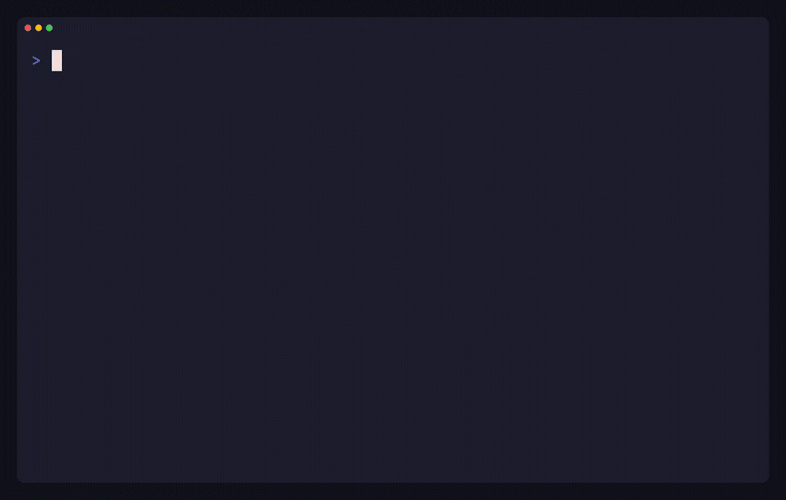

# Xanthe Incident Agent

An incident-response agent that drives a runbook **on rails**. The procedure is a plain
[XState](https://stately.ai/docs/xstate) machine mounted as an MCP server by
[Xanthe](https://github.com/msradam/xanthe), and the agent can only take the moves the machine
allows. The division of labor:

- the **machine** owns the procedure (you cannot mitigate before diagnosing, resolve before
  recovery is verified, or close before a postmortem is written),
- the **agent** supplies judgment (the hypothesis, the root cause, the mitigation),
- the **ledger** is the audit trail (every step and every refused step, hash-chained).



A premature `resolve` is refused by the server, not trusted to the model's judgment, and the
refusal is recorded. By the time the incident is `closed`, the machine's context is a complete
postmortem, assembled as a side effect of being forced through the right order.

## Run it

```sh
npm install
```

### Offline (deterministic policy, no API key)

```sh
npm start
```

A scripted policy walks the same gated runbook to resolution and verifies the ledger.

### With Claude

```sh
npm run agent            # or: MODEL=claude-opus-4-8 npm run agent
```

Uses the [Claude Agent SDK](https://code.claude.com/docs/en/agent-sdk/overview), which
authenticates with your existing Claude Code login (no API key). The Xanthe server is
registered as an MCP server, so Claude only ever acts through the gated `step` / `state`
tools: it reads state, narrates each move, recovers from refusals, and writes the postmortem.
It is held to the runbook the whole way.

## What you see

```
gate check: resolve before mitigating -> refused (legal here: triage)

driving the runbook:
  detected       triage               -> triaged
  triaged        page_oncall          -> engaged
  engaged        form_hypothesis      -> investigating
  ...
  resolved       write_postmortem     -> closed

final state: "closed" (terminal: true)
postmortem assembled by being forced through the runbook: { ...severity, rootCause, ... }
ledger: intact (10 entries, including the refused gate check)
```

## The runbook

`machine/incident-runbook.ts` is plain XState. Edit it, or point the agent at your own
runbook. Xanthe validates it at mount and rejects machines that auto-advance, so it stays a
step-gated procedure the agent drives one decision at a time.

## License

Apache-2.0.
